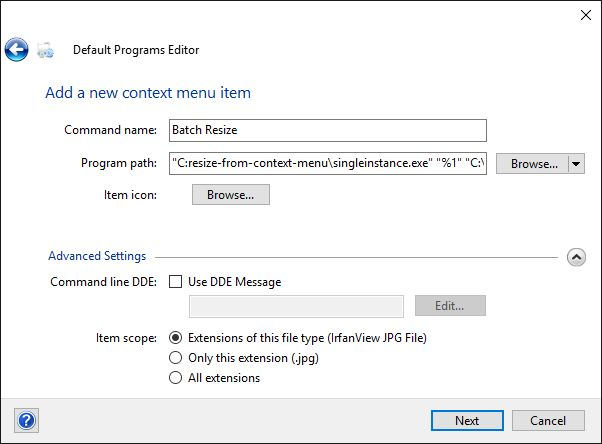

##What this is##
This repo provides the glue and how-to to make resizing and renaming a set of
images easier in Windows, using the "context menu" that appears when you right click in Explorer.  It supports selecting multiple images, too.

The primary use case for myself is renaming and resizing pictures from my camera, which are a larger resolution than I want to upload in some places, and have unhelpful names like P5250274.JPG.

##Components##
- [IrfanView](http://www.irfanview.com/): Super lightweight image editing program with commandline use.
- [AutoHotkey](https://autohotkey.com/docs/Scripts.htm#cmd): Scripting language for Windows. Provides the GUI. It's also awesome for hotkeys, hotstrings.
- [SingleInstance](https://github.com/zenden2k/context-menu-launcher): Program that implements [DDE](https://en.wikipedia.org/wiki/Dynamic_Data_Exchange), allowing multiple files to be passed to a single instance of another program (AutoHotkey in this case).
- [Default Programs Editor](http://defaultprogramseditor.com/)
- This repository's AHK script.

Tested solely on x64 Windows 10.

##Setting it up##
1. Install **IrfanView**
2. Install **AutoHotkey**
3. Get `singleinstance.exe`, whether from the project's link, or by building it yourself (needs Visual Studio; didn't quite succeed myself). Put it somewhere.
4. Install **Default Programs Editor**
5. Clone this repo.
6. Check that the path to IrfanView in ResizePromptGui.ahk is correct.
7. Right click on ResizePromptGui.ahk and click "Compile Script". This produces ResizePromptGui.exe
8. Run Default Programs Editor. You want to select: File Type Settings -> Context Menu, and then select .jpg (and possibly also .png, if you do this a second time)
9. Click "Add..."
10. Enter a command name, e.g. "Batch Resize".
11. Enter the following line in Program path `"C:\path\to\singleinstance.exe" "%1" "C:\Path\To\ResizePromptGui.exe" $files`
12. Click "Next"
13. Click "Save Context Menu"
14. All set! Repeat for .jpeg and .png files if desired (or any format), or just exit out of Default Programs Editor.
15. To see it in action, right click on a .jpg file and select "Batch Resize".

##Issues##
Seems to have issues with mixing capitalization (.jpg and .JPG images in same selection).

Autohotkey may have issues with runtime permission in some cases. I fixed this for myself at one point via googling, and promptly forgot the details.

##Other considerations##
I'm sure I could have done this with ImageMagick. But I have a loyalty of sorts to IrfanView.  It's GUI and hotkeys make quick image manipulation super fast and convenient. (I wish I could find an equivalent on Linux that works out of the box...)

You can do more advanced processing using .ini files with IrfanView. I didn't have a need for this.

If you really want, after compiling the AHK script, you can uninstall AutoHotkey.
